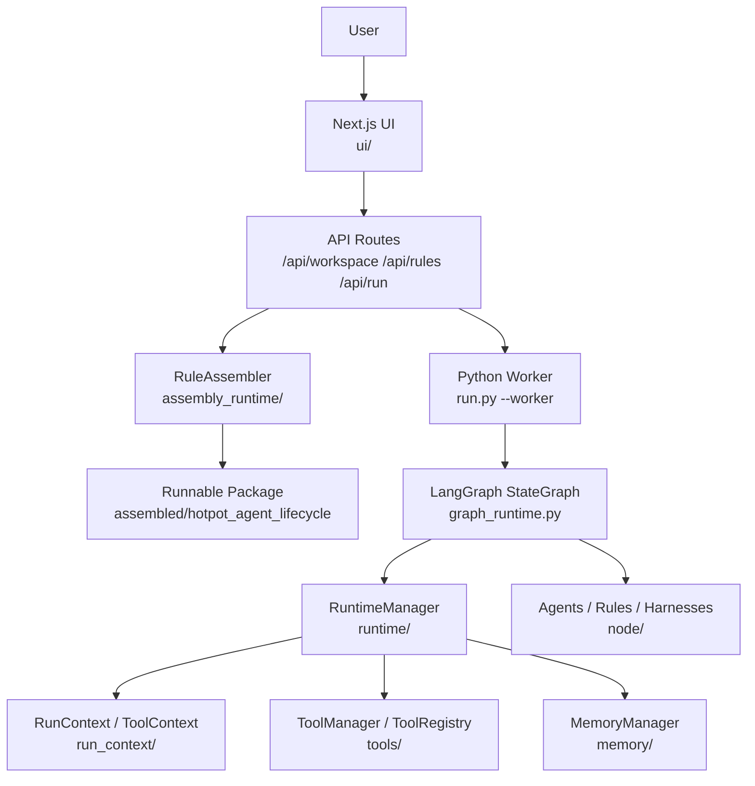
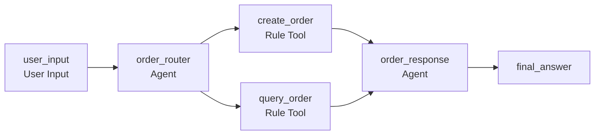
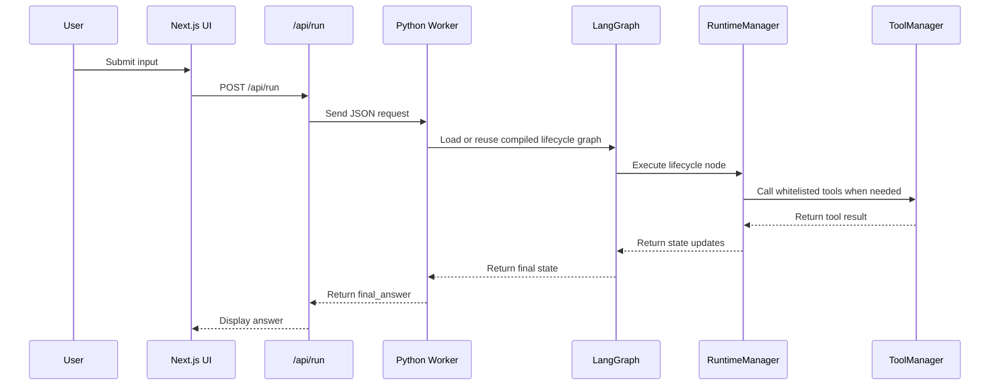

# CreatHarness

CreatHarness is a composable Agent Harness runtime and visual orchestration studio. It lets you describe an agent workflow with YAML, assemble it into a runnable Python package, and operate the workflow from a Next.js canvas UI.

The current example project is an ordering workflow: user input is routed into order creation or order lookup, rule tools persist/query local order records, and a final agent formats the response.

## Features

- YAML-defined lifecycle graphs for agents, rules, adapters, harnesses, and user input nodes.
- Python runtime based on LangGraph `StateGraph`.
- Tool registry with caller permissions, node-level whitelists, and runtime audit records.
- Runtime services for run context, tool context, event bus, and memory.
- Assembly step that turns `node/` definitions into an isolated runnable package under `assembled/`.
- Next.js visual studio for managing rules, editing orchestration graphs, and running the assembled workflow.

## Repository Layout

```text
CreatHarness/
├── node/                 # Source definitions for agents, rules, harnesses, adapters, and lifecycle YAML
├── assembly_runtime/     # Assembler that builds runnable packages from node/
├── assembled/            # Generated runnable packages; rebuild instead of editing directly
├── run_context/          # Component protocol, run state, tool context, and event abstractions
├── runtime/              # RuntimeManager and RuntimeServices
├── memory/               # Short-term and long-term memory implementations
├── tools/                # Shared tool registry, tool manager, and built-in business tools
├── data/                 # Local demo data such as order records
├── docs/                 # Architecture and runtime notes
└── ui/                   # Next.js visual orchestration interface
```

## System Architecture



## Lifecycle Flow



## Runtime Sequence



## Requirements

- Python 3.10+
- Node.js 18+
- npm

Python packages are listed in `requirements.txt`. Frontend packages are listed in `ui/package.json`.

## Setup

Create a local environment file from the template:

```powershell
copy .env.example .env
```

For the included Qwen-based agents, set `QWEN_API_KEY` or `DASHSCOPE_API_KEY` in the local `.env`. You can optionally set `QWEN_BASE_URL` and `QWEN_MODEL`. Never commit the real key.

Install Python dependencies:

```powershell
python -m pip install -r requirements.txt
```

Install frontend dependencies:

```powershell
cd ui
npm install
```

## Run the UI

From the frontend directory:

```powershell
cd ui
npm run dev
```

Open:

```text
http://localhost:3000
```

The UI can read the lifecycle YAML, edit rules and orchestration nodes, reassemble the current graph, and run the workflow through the Python worker.

## Run the Assembled Workflow Directly

First assemble the workflow:

```powershell
python assembly_runtime/rule_assembler.py node assembled --lifecycle-file hotpot_agent_lifecycle.yaml --force
```

Run once from the assembled package:

```powershell
cd assembled/hotpot_agent_lifecycle
python run.py "我要毛肚、牛肉和白菜"
```

Run in worker mode:

```powershell
python run.py --worker
```

Then send one JSON request per line:

```json
{"id":"1","input":"我要毛肚、牛肉和白菜"}
```

## Development Workflow

1. Edit source components under `node/`, `runtime/`, `run_context/`, `memory/`, or `tools/`.
2. Reassemble the runnable package with `rule_assembler.py`.
3. Validate Python syntax.
4. Build or restart the UI.

Useful commands:

```powershell
python assembly_runtime/rule_assembler.py node assembled --lifecycle-file hotpot_agent_lifecycle.yaml --force
python -m compileall -q assembly_runtime node run_context runtime memory tools
cd ui
npm run build
```
