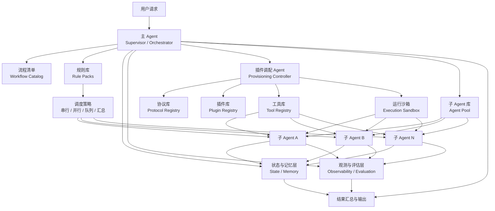

# Agent Harness 插件化架构提案

版本：v1.0  
日期：2026-08-29

## 1. 提案目标

本文档用于定义一套面向 Agent Harness 的系统性架构方案。该方案以插件化为核心，目标是让系统能够根据不同任务快速装配规则、工具、协议与执行环境，并由主控 Agent 统一调度多个子 Agent 协同完成工作。

与单体式 Agent 方案相比，本提案希望解决以下问题：
- 不同任务类型需要不同规则和工具，系统需要具备可插拔能力。
- 多个子 Agent 的协作需要统一编排，而不是临时拼接。
- 插件、工具、协议、沙箱之间需要稳定接口，避免耦合失控。
- 规则切换、任务切换、能力扩展时，需要尽量减少对主系统的影响。

## 2. 核心设计思想

本方案采用“主控编排 + 插件化能力装配 + 子 Agent 池 + 协议标准化”的结构。

系统接收到用户请求后，由主 Agent 先读取流程清单，根据流程决定需要加载哪些规则、插件、工具和子 Agent。随后主 Agent 以任务为单位完成规划、调度、分发、汇总和终止。子 Agent 不直接拥有全局控制权，而是作为受控执行单元按需领取工作。

该架构的中心不再是某一个万能 Agent，而是一个可装配、可调度、可观测的运行平台。

## 2.1 Harness 规则解耦加载方案

Harness 规则不应该被写成一个大而全的单体文件，而应拆成多个可独立加载、可组合、可版本化的规则包。这样做的目标，是把“规则定义”和“规则执行”分离开，避免工具调用规则、Agent 协作规则、流程规则、校验规则彼此缠绕。

### 2.1.1 规则分层

建议将 Harness 规则拆成五层：

1. **Core Rules**：运行底座规则，负责生命周期、权限、沙箱、状态、日志等最基础约束。
2. **Tool Rules**：工具调用规则，负责工具选择、参数校验、失败重试、回退与结果格式。
3. **Agent Rules**：Agent 协作规则，负责子 Agent 分配、并行/串行策略、回收与隔离。
4. **Workflow Rules**：流程规则，负责任务阶段、执行顺序、触发条件与中止条件。
5. **Validation Rules**：验证规则，负责自检、评估、验收与人工确认。

### 2.1.2 规则包形式

每个规则包都应包含机器可读的 `manifest`，至少声明：
- `id`：规则包唯一标识
- `version`：版本号
- `scope`：作用范围
- `depends_on`：依赖项
- `conflicts`：冲突项
- `priority`：优先级
- `phases`：适用阶段

规则包本身只描述“允许什么、禁止什么、推荐什么、先后顺序是什么”，不直接写执行代码。真正的执行动作由 runtime 负责。

### 2.1.3 加载顺序

推荐的加载顺序是：

1. 加载 `Core Rules`
2. 加载协议与 Schema
3. 加载 `Tool Rules`
4. 加载 `Agent Rules`
5. 加载 `Workflow Rules`
6. 加载 `Validation Rules`
7. 做一次冲突检测、依赖解析和版本冻结
8. 将规则编译成当前任务的 runtime policy

### 2.1.4 解耦原则

- 规则不直接调用工具。
- 规则不直接创建或销毁 Agent。
- 规则只输出策略和约束。
- 主 Agent 只负责装配和调度，不负责解释规则内部细节。
- 子 Agent 只消费已编译的策略，不读取未解析的原始规则。

### 2.1.5 运行时绑定

规则应当按“任务作用域”绑定，而不是全局绑定。也就是说：
- 当前任务绑定当前版本的规则包。
- 新任务可以使用新版本规则包。
- 旧任务继续沿用旧版本，直到完成。

这样可以避免在规则切换时出现上下文丢失、执行中断或结果不一致的问题。

## 3. 架构总览

### 3.1 关键组件

#### 1) 用户入口
用户向系统提交任务、问题或目标。输入内容可以是自然语言请求，也可以是结构化任务。

#### 2) 主 Agent（Supervisor / Orchestrator）
主 Agent 是系统的控制核心，负责：
- 接收用户请求
- 读取流程清单
- 选择规则集
- 请求装配所需插件与工具
- 从子 Agent 库中分配执行单元
- 建立任务队列或并行执行图
- 汇总结果并返回用户

主 Agent 不应承担具体工具细节或插件实现逻辑，否则会成为新的单点复杂中心。

#### 3) 流程清单（Workflow Catalog）
流程清单定义任务启动顺序和执行阶段，用来回答“先做什么，后做什么”。

例如：
1. 加载规则库
2. 根据规则分配子 Agent
3. 运行用户问题
4. 汇总结果
5. 校验并输出

流程清单是调度入口，不直接描述底层实现细节。

#### 4) 规则库（Rule Packs / Policy Packs）
规则库定义任务协作策略，包括：
- 任务拆分规则
- 子 Agent 选择规则
- 执行顺序规则
- 并行/串行规则
- 安全限制规则
- 输出质量要求

规则库决定当前任务如何被组织，是系统行为的重要配置层。

#### 5) 子 Agent 库（Agent Pool）
子 Agent 库保存不同职责的执行单元，例如：
- 规划 Agent
- 检索 Agent
- 编码 Agent
- 审核 Agent
- 测试 Agent
- 汇总 Agent

主 Agent 根据规则从子 Agent 库中借用实例或会话，在任务结束后归还。为降低耦合，推荐将子 Agent 设计为“轻状态或无状态工作单元”。

#### 6) 插件库（Plugin Registry）
插件库存储可装配能力，例如：
- 规则插件
- 工具插件
- 沙箱插件
- 检索插件
- 评测插件
- 审计插件

插件库的职责是能力供给，而不是任务控制。

#### 7) 插件调配 Agent（Plugin Provisioning Agent）
插件调配 Agent 负责把插件库中的能力按任务需求装配到运行环境中，例如：
- 选择合适插件
- 校验插件依赖
- 准备注入顺序
- 绑定协议定义
- 初始化运行沙箱
- 管理生命周期

它更像一个“能力装配控制器”，不应与主 Agent 的全局调度职责混在一起。

#### 8) 协议库（Protocol Registry）
协议库不是简单的“说明书”，而应该是机器可读的标准接口层，用于描述：
- 插件能力说明
- 输入输出 Schema
- 调用约束
- 权限要求
- 错误码
- 版本信息
- 示例与兼容性声明

协议库的作用是降低插件、工具、Agent 之间的集成成本，并提高可替换性。

#### 9) 工具库（Tool Registry）
工具库提供具体执行能力，例如：
- 文件操作
- 代码运行
- 检索
- API 调用
- 测试执行
- 数据转换

工具是原子能力，不应直接承担高层编排逻辑。

#### 10) 运行沙箱（Execution Sandbox）
运行沙箱负责隔离执行环境，包括：
- 权限边界
- 文件系统隔离
- 网络隔离
- 进程控制
- 资源配额
- 失败回收

沙箱可以本身也以插件方式装配，以支持不同风险等级任务。

#### 11) 状态与记忆层（State / Memory Layer）
这是当前原始想法中最需要补充的一层。它用于保存：
- 任务上下文
- 中间结果
- 子 Agent 交接状态
- 插件装配状态
- 当前规则版本
- 重试记录
- 用户偏好

如果状态只放在主 Agent 或子 Agent 内部，规则切换和故障恢复都会变得非常脆弱。

#### 12) 观测与评估层（Observability / Evaluation Layer）
这一层负责记录和评估系统运行质量，包括：
- 调度日志
- 工具调用日志
- 子 Agent 产出记录
- 延迟与成本统计
- 失败原因
- 质量评分
- 人工复核点

没有这一层，系统很难稳定演进。

## 4. 推荐架构图

## 5. 运行流程说明

### 5.1 标准执行流程

用户输入问题后，系统按以下顺序运行：

1. 主 Agent 接收请求并读取流程清单。
2. 主 Agent 根据任务类型选择合适的规则库版本。
3. 主 Agent 调用插件调配 Agent，装配当前任务所需的插件、工具、协议和运行沙箱。
4. 主 Agent 依据规则库从子 Agent 库中分配一个或多个子 Agent。
5. 主 Agent 建立调度结构，可以是串行队列，也可以是并行分发再汇总。
6. 子 Agent 在运行沙箱中使用工具库完成各自子任务。
7. 中间结果写入状态与记忆层，运行日志写入观测与评估层。
8. 主 Agent 汇总产出，并根据规则执行复核或二次修正。
9. 输出最终结果，释放本任务持有的临时资源。

### 5.2 规则切换流程

当需要切换规则库时，不建议直接“卸载旧规则再加载新规则”，而建议采用版本化切换：

1. 当前运行任务继续绑定旧规则版本。
2. 新任务开始时加载新规则版本。
3. 子 Agent 与插件实例按任务作用域绑定，而不是全局绑定。
4. 已结束任务释放实例，未结束任务保持原版本直到完成。

这样可以避免中途切换导致上下文丢失、输出不一致或任务中断。

## 6. 对现有想法的主要问题诊断

### 6.1 职责边界不够清晰
当前设想里，主 Agent、插件调配 Agent、协议库和插件库之间存在职责交叉。如果不提前划清边界，后面容易出现主 Agent 管得过多、插件调配 Agent 又重复做一遍调度的情况。

### 6.2 缺少独立状态层
你原始设计中提到了取出子 Agent、放回子 Agent、切换规则库，但没有明确描述任务状态保存在何处。这会导致：
- 规则切换时丢失上下文
- 子 Agent 交接不稳定
- 故障恢复困难
- 审计难度高

### 6.3 队列式调度过于单一
如果所有子 Agent 都通过单一队列执行，系统吞吐、容错和响应速度都会受到限制。很多任务更适合并行拆分后再汇总。

### 6.4 插件协议过于文档化
如果协议库只是“使用说明”，那么插件系统会高度依赖人工约定，难以自动发现、自动校验和自动装配。

### 6.5 缺少评估和护栏设计
真实系统需要回答这些问题：
- 哪一步最容易失败
- 哪个子 Agent 质量最低
- 哪个插件代价最高
- 什么时候需要人工确认
- 如何进行回滚和重试

这些都需要独立的观测和评估体系。

## 7. 建议的改进方向

### 7.1 将主 Agent 收敛为编排中心
主 Agent 只负责：
- 接收任务
- 规划流程
- 分发执行
- 汇总结果
- 触发终止

不要让主 Agent 直接持有过多插件实现细节。

### 7.2 将协议库升级为标准接口注册表
协议至少应包含：
- 名称
- 版本
- 能力描述
- 输入输出定义
- 依赖关系
- 权限边界
- 错误处理方式

这会让插件系统更接近标准化平台，而不只是扩展脚本集合。

### 7.3 子 Agent 实例化与状态解耦
推荐把“Agent 能力定义”和“任务状态”分离：
- Agent 负责执行逻辑
- State 层负责持久化上下文

这样切换规则、重启进程或更换子 Agent 时，不会破坏任务连续性。

### 7.4 使用任务作用域资源装配
每个任务应持有自己的：
- 规则版本
- 插件实例
- 工具授权
- 状态句柄
- 审计记录

不要把这些都当成全局单例，否则不同任务之间容易互相污染。

### 7.5 引入并行编排能力
建议在调度策略中支持：
- 串行执行
- 并行 fan-out
- 汇总 fan-in
- 失败重试
- 审核回路
- 人工确认节点

### 7.6 增加安全与审计控制
特别是当系统支持代码运行、文件修改、网络访问时，应当明确：
- 工具权限最小化
- 沙箱隔离级别
- 审批机制
- 敏感操作日志
- 高风险任务熔断

## 8. 推荐的逻辑分层

为了帮助落地，建议把系统拆成以下六层：

1. 交互层  
负责接收用户请求和返回结果。

2. 编排层  
由主 Agent 驱动流程、规则、调度和任务生命周期。

3. 能力装配层  
由插件调配 Agent 装配插件、协议、工具和沙箱。

4. 执行层  
由子 Agent 在受控环境中完成具体工作。

5. 状态层  
统一保存上下文、中间结果和任务状态。

6. 观测治理层  
负责评估、日志、审计、安全和人工介入。

## 9. 演进路线建议

### 第一阶段：可运行原型
目标是跑通最小闭环：
- 一个主 Agent
- 一个流程清单
- 一个规则库
- 一个子 Agent 池
- 一个简单工具库
- 一个基础沙箱

### 第二阶段：标准化插件体系
补齐：
- 协议 Schema
- 插件元数据
- 生命周期管理
- 自动装配
- 版本控制

### 第三阶段：多 Agent 协同优化
引入：
- 并行编排
- 汇总 Agent
- 审核 Agent
- 失败重试
- 人工确认

### 第四阶段：治理与生产化
建设：
- 全链路观测
- 成本控制
- 安全审计
- 自动评测
- SLA 和可靠性策略

## 10. 最终结论

你的原始思路具备很好的平台化方向，尤其是“插件化架构 + 主 Agent 调度 + 子 Agent 池 + 规则驱动”的核心框架是成立的。

但如果要把它从概念提升为可扩展的系统架构，最需要补上的四个部分是：
- 明确职责边界
- 引入独立状态层
- 将协议库标准化
- 增加观测、评估与安全治理

因此，推荐把这套系统定义为：

**一个以主 Agent 为编排中心、以规则库为任务策略核心、以插件和协议为能力装配基础、以子 Agent 池为执行单元、以状态层和观测层为系统护栏的 Agent Harness 平台。**

这个定义更适合作为正式提案的总述，也更便于后续扩展到多团队协作、不同插件生态和生产级部署。
