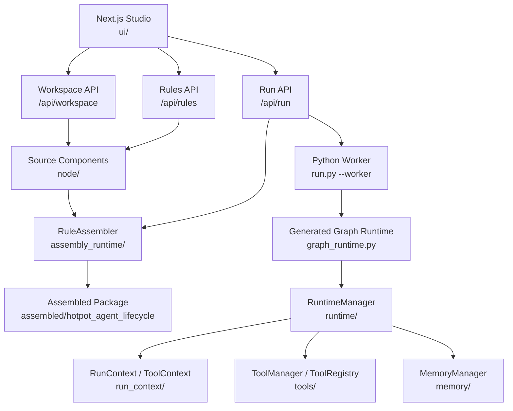
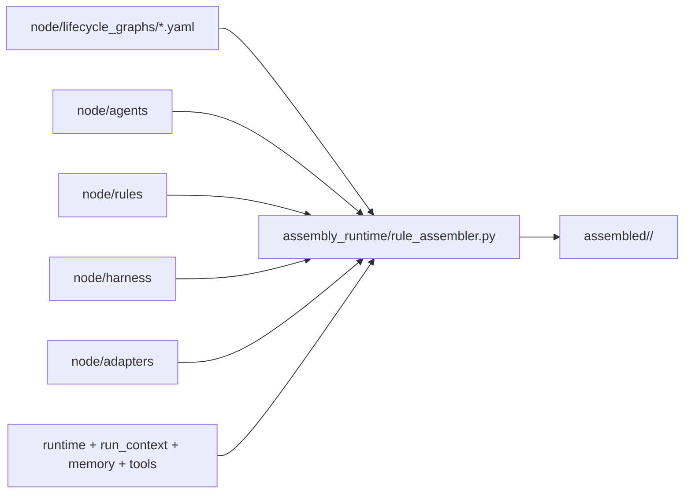
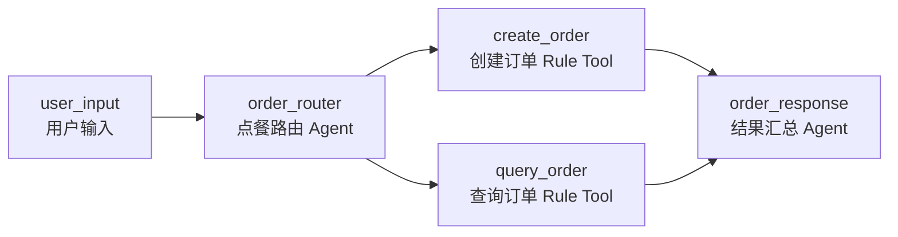
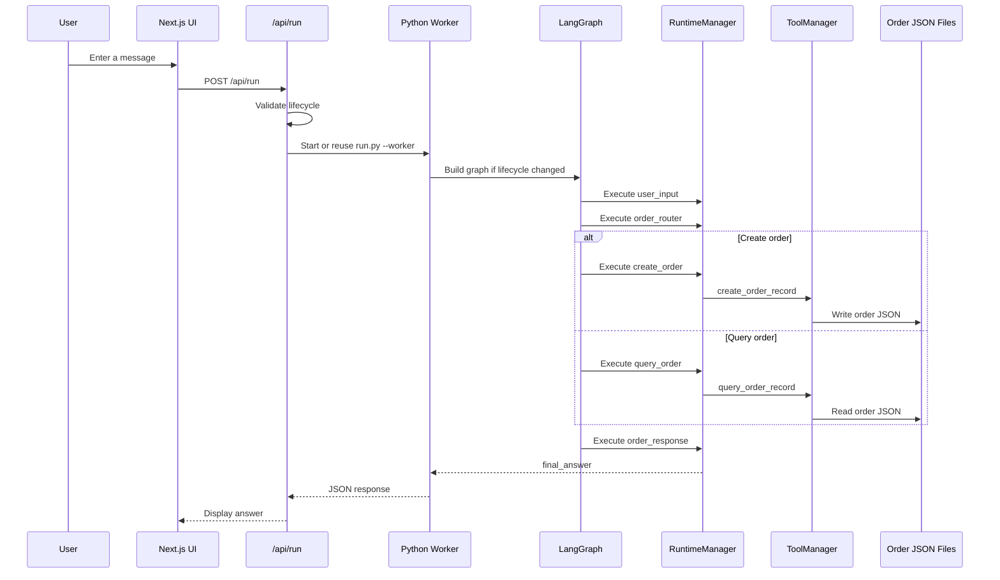
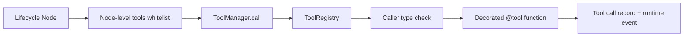
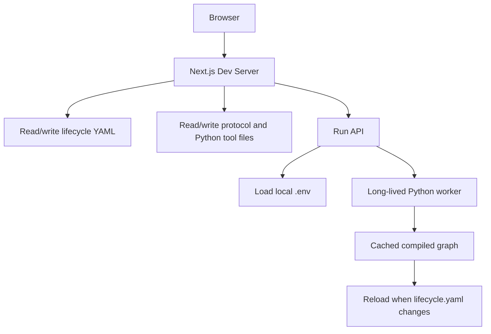

# CreatHarness Architecture and Runtime

This document explains how CreatHarness is organized, how source definitions are assembled into a runnable package, and how the UI invokes the Python runtime.

## 1. Overall Architecture



## 2. Directory Responsibilities

| Directory | Responsibility |
|---|---|
| `ui/` | Visual studio for rule management, lifecycle editing, and workflow execution. |
| `node/` | Source of truth for lifecycle YAML, agent implementations, rule tools, adapters, and harnesses. |
| `assembly_runtime/` | Builds an isolated runnable package from `node/` and shared runtime modules. |
| `assembled/` | Generated packages with `run.py`, `graph_runtime.py`, copied components, and manifest files. |
| `runtime/` | Coordinates graph execution, node execution, lifecycle events, and shared services. |
| `run_context/` | Defines component requests/responses, run metadata, event models, and tool-call records. |
| `tools/` | Provides tool registration, tool authorization, and built-in business tools. |
| `memory/` | Provides short-term and long-term memory stores. |
| `data/` | Stores demo runtime data such as order JSON records. |

## 3. Source-to-Package Assembly



The assembler validates the lifecycle YAML, copies component files, copies shared runtime modules, writes `lifecycle.yaml`, creates `assembly_manifest.json`, and generates `graph_runtime.py` plus `run.py`.

Recommended assembly command:

```powershell
python assembly_runtime/rule_assembler.py node assembled --lifecycle-file hotpot_agent_lifecycle.yaml --force
```

## 4. Current Lifecycle

The current source lifecycle is `node/lifecycle_graphs/hotpot_agent_lifecycle.yaml`.



The state fields include user text, detected intent, order items, query order id, create/query results, created/queried order records, and the final answer.

## 5. Runtime Request Flow



## 6. Tool Permission Chain



Tool calls pass two checks before execution:

- The lifecycle node must list the tool name in its `tools` field.
- The tool decorator must allow the normalized caller type, such as `agent`, `rule`, or `harness`.

## 7. UI and Worker Relationship



The worker mode keeps a compiled graph alive and accepts newline-delimited JSON requests. This avoids rebuilding the graph for every UI request while still allowing reloads when the lifecycle file changes.

## 8. Safe Publishing Checklist

- Keep `.env` private and publish only `.env.example`.
- Exclude `node_modules/`, `.next/`, `__pycache__/`, `.pyc`, sqlite databases, and logs.
- Review generated data under `data/` before publishing.
- Decide whether `assembled/` should be committed as a ready-to-run example or regenerated by users.
- Add a `LICENSE` file if the repository will be public.
